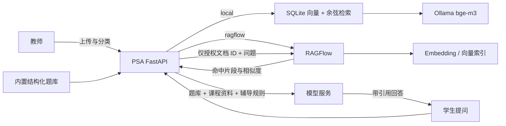

# 系统架构与数据边界

## 组成

- `web/`：React 单页应用，提供学生学习空间和教师工作空间。
- `backend/src/`：FastAPI 应用，负责身份、题库、答疑、教学包、班级任务与学习分析。
- `backend/data/probability_questions.jsonl`：1007 道只读课程题库，部署时随镜像交付。
- PostgreSQL：正式环境的账号、班级、任务、作答、会话和教学包数据。
- Alembic：数据库结构升级；容器启动时先执行迁移，再启动应用。
- 模型服务：由部署企业通过 `DEEPSEEK_API_KEY` 配置；分层教学包规则引擎不依赖模型 Key。
- 本地 RAG（作品演示）：PSA 解析文件、重叠切片，Ollama `bge-m3` 生成向量，SQLite 保存 JSON 向量，Python 计算余弦相似度。
- RAGFlow（企业模式）：负责课程文件解析、切片、Embedding、向量/关键词混合检索；PSA 只保留用户、班级、授权和提供方 ID，不复制 RAGFlow 向量。

## 关键业务链路

### 学生学习

登录 → 加入班级 → 接收诊断/干预/迁移任务 → 提交作答 → 获得诊断 → 更新掌握度和学习路径。

### 教师教学闭环

创建班级 → 发布短诊断 → 查看班级证据 → 审核动态分组 → 下发干预 → 用无提示迁移题复验。

教师可以更换班级码、归档或恢复班级、移出成员，以及撤回、重新发布或归档任务。此类操作保留既有作答证据，避免破坏审计链路。

### 分层教学包

选择主题、课堂类型、时长和学情 → 规则引擎选题并闭合时间 → 分离教师执行版与无答案学生版 → 编辑保存 → 导出 Markdown 或打印/保存 PDF → 发布任一层级为班级任务。

### 课程资料问答

教师创建资料库 → 上传文件并标注资料类型/学生可见性 → 当前知识库后端解析、切分并向量化 → 教师绑定自己的班级 → 学生提问时 PSA 先计算授权文档集合 → 本地模式只查询授权文档的 SQLite 切片，RAGFlow 模式只发送授权文档 ID → 将命中片段与结构化题库共同送入辅导模型 → 保存并展示引用。

`hint`、`check` 和 `step` 三种辅导方式不会检索 `solution` 或 `teacher_only` 资料；学生在 `full` 模式仍不能检索 `teacher_only`。RAGFlow 超时或不可用时返回空资料集合，答疑继续使用内置题库，主应用健康检查也不会因此失败。

## 权限和数据隔离

- 学生只能读取自己的任务、会话、作答和学习分析。
- 教师只能管理自己创建的班级、成员、任务和教学包。
- 教师只能管理自己的课程资料库，并且只能绑定到自己创建的班级。
- 学生只可检索已绑定到其活跃班级、解析完成且标记为学生可见的文档；后端按文档 ID 做强制过滤，不依赖前端隐藏。
- 班级雷达只统计该班任务中的作答，不读取学生个人自学会话或其他班级证据。
- 学生必须完成至少一次作答后才能查看参考答案；教师可查看题库答案。
- 浏览器会话使用 HttpOnly Cookie；生产模式要求安全密钥、PostgreSQL 和受限 CORS。

## 运行与扩展边界

应用为单体服务，前端构建产物由 FastAPI 同域提供，适合企业先以一套容器栈交付。RAGFlow 是独立可选服务，不放进 PSA 的轻量 Docker Compose，以免把 Elasticsearch/Infinity、对象存储与模型运行时的资源需求强耦合到主应用。后续若并发量提升，可将应用横向扩容，并由企业提供反向代理、集中日志、监控告警、对象存储和托管 PostgreSQL。数据库、题库和 RAGFlow 客户端均与界面分离，无需重写前端即可替换基础设施。
